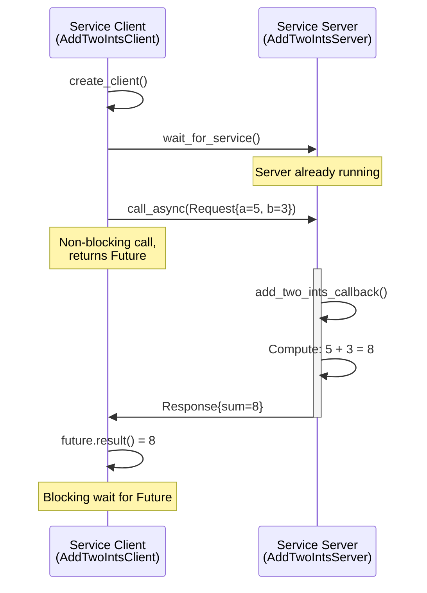
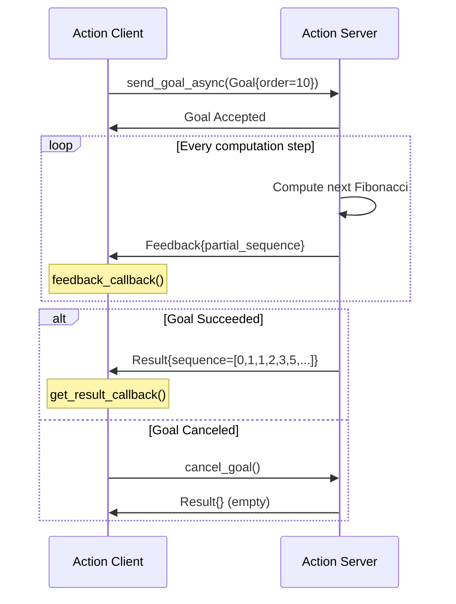

# Chapter 3: Services, Actions, and Parameters

In Chapter 2, you learned about **topics**—the asynchronous, many-to-many communication pattern ideal for streaming sensor data. But not all robot communication fits the publish-subscribe model. What if you need:

- **A one-time computation** (e.g., inverse kinematics for an arm)?
  → Use **services** (synchronous request-response)
- **A long-running task with progress updates** (e.g., navigate to a waypoint)?
  → Use **actions** (asynchronous with feedback)
- **Configurable behavior** (e.g., adjust PID gains at runtime)?
  → Use **parameters** (dynamic configuration)

This chapter teaches you these advanced communication primitives and shows how to integrate **AI decision logic** with ROS 2 control systems.

## 3.1 Services: Request-Response Communication

A **service** is a synchronous, one-to-one communication pattern:
- **Client** sends a **request** to a **server**
- **Server** processes the request and returns a **response**
- Communication is **blocking**: client waits for the response (or times out)

Use services for:
- ✅ Infrequent operations (trigger calibration, query robot state)
- ✅ Computationally intensive tasks (path planning, inverse kinematics)
- ✅ Configuration changes (reset odometry, switch modes)
- ❌ High-frequency data streams (use topics)
- ❌ Tasks taking > 1 second (use actions for feedback)


### 3.1.1 Service Definitions

ROS 2 services use `.srv` files defining request and response types:

```
# example_interfaces/srv/AddTwoInts.srv
int64 a
int64 b
---
int64 sum
```

The `---` separator divides request (top) from response (bottom). Standard service types include:
- `std_srvs/srv/Trigger`: No request data, bool response + message
- `std_srvs/srv/SetBool`: Bool request, bool response + message
- `example_interfaces/srv/AddTwoInts`: Two integers → sum

### 3.1.2 Creating a Service Server

A **service server** listens for requests and executes a callback function:

**Service Server API:**

```python
self.srv = self.create_service(
    srv_type=AddTwoInts,           # Service type (from .srv file)
    srv_name='add_two_ints',       # Service name (string)
    callback=self.callback_function  # Function to handle requests
)
```

**Callback Signature:**

```python
def callback(self, request, response):
    # request: object with fields from request part of .srv
    # response: object with fields from response part of .srv
    response.field1 = compute_value()
    return response  # MUST return response object
```

### 3.1.3 Creating a Service Client

A **service client** sends requests and waits for responses:


**Service Client API:**

```python
# 1. Create client
self.client = self.create_client(AddTwoInts, 'add_two_ints')

# 2. Wait for service availability
self.client.wait_for_service(timeout_sec=5.0)

# 3. Create request object
request = AddTwoInts.Request()
request.a = 10
request.b = 20

# 4. Call service asynchronously
future = self.client.call_async(request)

# 5. Wait for response
rclpy.spin_until_future_complete(node, future)
response = future.result()
```

### 3.1.4 Service Communication Flow



ROS 2 supports two service call patterns:


## 3.2 Actions: Long-Running Tasks with Feedback

Services are great for quick computations, but what about tasks that take seconds or minutes? **Actions** extend the service pattern with:
- **Feedback**: Server sends progress updates during execution
- **Cancellation**: Client can cancel the goal mid-execution
- **Result**: Final outcome when task completes

Use actions for tasks that:
- ✅ Take > 1 second to complete (navigation, object manipulation)
- ✅ Require progress updates (distance to goal, current phase)
- ✅ Can be cancelled (stop navigation, abort grasp)
- ✅ Have distinct success/failure outcomes

Examples:
- Navigate to waypoint (feedback: distance remaining)
- Grasp object (feedback: gripper closure percentage)
- Execute dance sequence (feedback: current pose index)
- Train neural network (feedback: epoch, loss)


### 3.2.1 Action Definitions

Actions use `.action` files with three parts:

```
# example_interfaces/action/Fibonacci.action
# Goal
int32 order
---
# Result
int32[] sequence
---
# Feedback
int32[] partial_sequence
```

**Three sections**:
1. **Goal**: What the client requests (e.g., "navigate to (x, y)")
2. **Result**: Final outcome (e.g., "reached goal" or "failed - obstacle")
3. **Feedback**: Periodic updates (e.g., "50% complete, 2.3m remaining")

### 3.2.2 Creating an Action Server

**Action Server API:**

```python
self._action_server = ActionServer(
    node=self,                     # Parent node
    action_type=Fibonacci,         # Action type
    action_name='fibonacci',       # Action name
    execute_callback=self.execute  # Callback function
)

def execute_callback(self, goal_handle):
    # 1. Access goal: goal_handle.request.field
    order = goal_handle.request.order

    # 2. Publish feedback periodically
    feedback = Fibonacci.Feedback()
    goal_handle.publish_feedback(feedback)

    # 3. Check for cancellation
    if goal_handle.is_cancel_requested:
        goal_handle.canceled()
        return Fibonacci.Result()

    # 4. Mark as succeeded and return result
    goal_handle.succeed()
    result = Fibonacci.Result()
    return result
```


### 3.2.4 Action Communication Flow



## 3.3 Parameters: Runtime Configuration

**Parameters** allow you to configure node behavior at runtime without restarting the node.


**Parameters** are key-value pairs stored in each node:
- Types: `bool`, `int`, `float`, `string`, `byte_array`, `bool_array`, `int_array`, `float_array`, `string_array`
- Can be set via command line, launch files, or programmatically
- Support dynamic updates with parameter callbacks

Use cases:
- ✅ Tunable constants (PID gains, thresholds, timeouts)
- ✅ Mode switching (debug mode, simulation vs. hardware)
- ✅ Resource paths (model files, config files)


### 3.3.1 Declaring and Using Parameters

**Setting Parameters at Launch:**

```bash
# Command line
ros2 run my_package parameter_node --ros-args \
  -p robot_name:=optimus \
  -p max_speed:=2.0 \
  -p debug_mode:=true

# Inspect parameters
ros2 param list
ros2 param get /parameter_node robot_name
ros2 param set /parameter_node max_speed 3.0
```


## 3.5 Hands-On Exercise: Implement a Calculator Service

### Problem Statement

Create a calculator service that supports four operations: addition, subtraction, multiplication, and division.

### Requirements

**Service Definition** (`srv/Calculate.srv`):
```
float64 a
float64 b
string operation  # "add", "subtract", "multiply", "divide"
---
float64 result
bool success
string message
```

**Service Server** (`calculator_server.py`):
- Service name: `/calculator`
- Support all four operations
- Return `success=False` and error message for:
  - Division by zero
  - Invalid operation string
- Log each request and response

**Service Client** (`calculator_client.py`):
- Accept command-line arguments: `a b operation`
- Call service and display result
- Handle service call failures gracefully

### Testing

```bash
# Terminal 1: Run server
python3 calculator_server.py

# Terminal 2: Test with client
python3 calculator_client.py 15.5 3.2 add
python3 calculator_client.py 10 0 divide  # Should fail gracefully

# Terminal 3: Test with CLI
ros2 service call /calculator my_package/srv/Calculate \
  "{a: 100, b: 25, operation: 'subtract'}"
```

### Deliverable

1. Three files: `Calculate.srv`, `calculator_server.py`, `calculator_client.py`
2. Screenshot showing successful addition and failed division by zero
3. Answer: How would you extend this to support exponentiation?


## Key Takeaways

<div className="key-takeaways">

### ✓ Core Concepts Mastered

- **Services provide synchronous request-response communication** for infrequent operations like computations, triggers, and queries
- **Actions extend services with feedback and cancellation** for long-running tasks (> 1 second) like navigation and manipulation
- **Action servers publish periodic feedback** during execution, allowing clients to monitor progress and cancel goals
- **Parameters enable runtime configuration** with dynamic updates through callbacks and validation
- **AI-ROS integration follows separation of concerns** with pure Python AI logic wrapped in ROS nodes
- **Async service calls** (`call_async`) are preferred over blocking calls to prevent node deadlocks
- **Real-time control requires < 100ms decision cycles** with profiling and optimization for AI inference latency

</div>

## What's Next?

In **Chapter 4: URDF Robot Modeling**, you'll learn to define robot structure:
- URDF syntax for links (rigid bodies) and joints (connections)
- Visual and collision geometry for simulation
- Kinematic chains for humanoid robots
- RViz2 visualization with joint_state_publisher

**Prerequisite Check**: Before proceeding, ensure you can:
- ✅ Create a service server and client for a custom service type
- ✅ Explain when to use services vs. actions
- ✅ Implement parameter validation with callbacks
- ✅ Separate AI decision logic from ROS communication code

---

**Next**: Chapter 4: URDF Robot Modeling (coming soon)